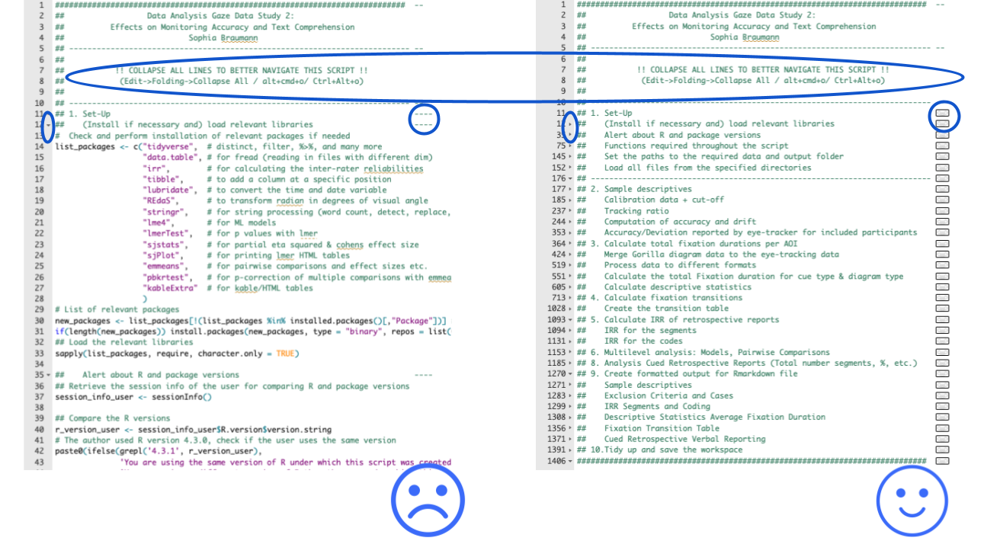

## Introduction  

This R project reflects the data cleaning and analyses of the article
_The Role of Feedback on Students’ Diagramming: Effects on Monitoring Accuracy and Text Comprehension:_ https://doi.org/10.1016/j.cedpsych.2023.102251  

For a more elaborate documentation, see Documentation.Rmd in the Documentation folder.

## Usage                      

### Less Experienced User:

   - Open the project using Rstudio by selecting <b>file</b> -> <b>new project</b> -> <b>version control</b> -> <b>git</b> and enter https://github.com/SopBra/NRO-PROO_Article_1_Effects_Of_Feedback_Standards_During_Diagramming

(Choose where you would like to store the project folder).

<b>To inspect the single data cleaning and analysis scripts:</b>

   - Open (via the files tab in RStudio) any of the scripts located in the Scripts folder, (select the whole script) and click Run

<b>To directly inspect the formatted output file of the analysis script:</b>

   - Open (via the files tab in RStudio) the Scripts folder and open + run the 'Package_Installation_Help.R' script
   - Open (via the files tab in RStudio) 'Article_1_Feedback_Standards_Output_Summary_Artificial_Data.Rmd' in the main directory and click 'knit'
   

### Experienced User:

  - You should be able to run all scripts (in /Scripts/) without pre-installing packages, this will be handled in the first part of each script (if the packages are not yet installed on your system).  
  - To knit the formatted output 'Article_1_Feedback_Standards_Output_Summary_Artificial_Data.Rmd' in the main directory, you will need to 
      -  run the two analysis scripts in Scripts/Scripts_Data_Analyses first, <b>OR</b>
      -  run the Package_Installation_Help.R in Scripts/ first.

### Disclaimer and WARNING:
This project is set-up in such a way that people without any programming background can understand and make use of the R scripts. The scripts are partly VERY long (think about 1500 lines of code).  
<b>I strongly recommend</b> folding the code to make navigation easier by:  

 -  <b>Navigating to Edit->Folding->Collapse All</b> or, 
 
 -  depending on the system you are using, with the <b>shortcuts: alt+cmd+o</b> or <b>ctrl+alt+o</b>

## Help                       
If you need help with using this project or any of the scripts, please don't hesitate to contact me (using Github or contacting me via email (find the address by searching for my name online, or navigate to the second/third version of this file ;)

## Feedback and Contributing  
If you have suggestions for improvements (and you are not comfortable with creating an Issue), please don't hesitate to contact me via Github or email.

Pull requests are welcome. For major changes, please open an issue first to discuss what you would like to change.

## License                    

[MIT](https://choosealicense.com/licenses/mit/)

## Project status             

This is the first version after publication. To be updated with (improved) future versions :)

